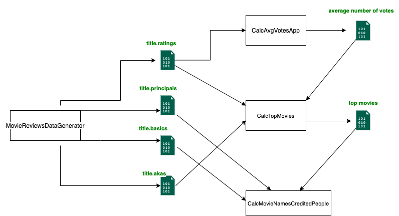

## Movie Reviews

### Movie Reviews Components Workflow

1) `MovieReviewsDataGenerator` produce the data for Movie Reviews Application.

2) `CalcAvgVotesApp` reads `title.ratings` data and generates `average number of votes`

3) `CalcTopMovies` reads `title.ratings`, `title.akas`, `average number of votes` and 
   produce the `top movies`

4) `CalcMovieNamesCreditedPeople`  `reads title.principal`, `title.basics`, `top movies` 
   and produce the `related movie names`, `credited peoples` for the top movies.




### Running Application

run mvn package command,
`/moviereviews> mvn package`
which generates `moviereviews-1.0-SNAPSHOT-jar-with-dependencies.jar` under `/moviereviews/target/` folder.

1) Generating Data,
Run the below command for generating data

`java -cp target/moviereviews-1.0-SNAPSHOT-jar-with-dependencies.jar org.example.moviereviews.datagenerator.MovieReviewsDataGenerator` 

2) Running AvgVotes Streaming Job,

keep `application.conf` same directory where it's running. 
below are the default `application.conf` properties for calculating average votes.

```
avgvotes {
       titleRatingsFilesPath = "data/input/input_title_ratings"
       averageVotesPath = "data/output/average_number_of_votes"
       averageNumberOfVotesColumnName = "averageNumberOfVotes"
       waterMarkDelay = "20 seconds"
       triggerTimeInterval = "5 seconds"
       checkPointPath = "checkpoint/avgvotes"
}
```

Run command,
 
`java -cp target/moviereviews-1.0-SNAPSHOT-jar-with-dependencies.jar org.example.moviereviews.streaming.CalcAvgVotesApp`

3) Running Top Movies Streaming Job,

keep `application.conf` same directory where it's running. 
below are the default `application.conf` properties for calculating top movies.

```
top_movies {
        titleRatingsPath = "data/input/input_title_ratings"
        titleAkasPath = "data/input/input_title_akas"
        averageVotesPath = "data/output/average_number_of_votes"
        topMoviesPath = "data/output/top_movies"
        waterMarkDelay = "20 seconds"
        triggerTimeInterval = "5 seconds"
        checkPointPath = "checkpoint/topmovies"
        numberOfTopMovies = 10
    }
```

Run command,

`java -cp target/moviereviews-1.0-SNAPSHOT-jar-with-dependencies.jar org.example.moviereviews.streaming.CalcTopMovies`

4) Running Related Movie Names and Credited People Streaming Job,

keep `application.conf` same directory where it's running. 
below are the default `application.conf` properties for calculating related movie names and credited people.

```
movienanes_creditedpeople {
        titlePrincipalsPath = "data/input/input_title_principals/"
        titleBasicsPath = "data/input/input_title_basics/"
        topMoviesPath = "data/output/top_movies"
        waterMarkDelay = "20 seconds"
        triggerTimeInterval = "5 seconds"
        checkPointPath ="checkpoint/movienanes_creditedpeople"
    }
```

Run command,

`java -cp target/moviereviews-1.0-SNAPSHOT-jar-with-dependencies.jar org.example.moviereviews.streaming.CalcMovieNamesCreditedPeople`


